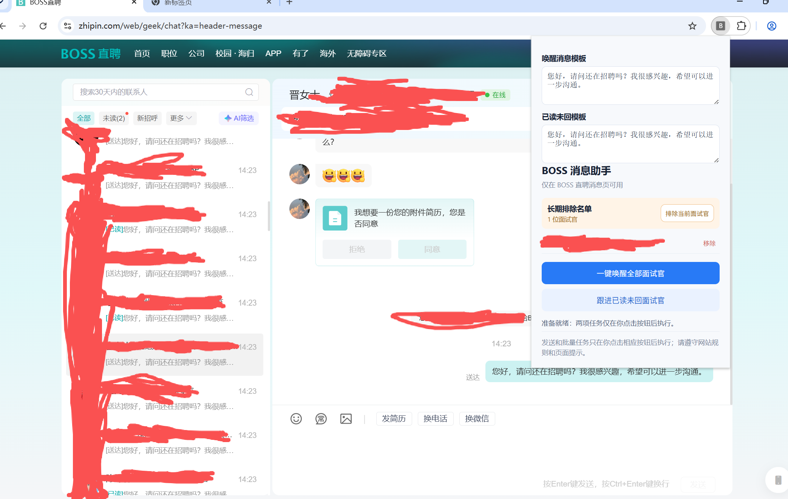

# BossMHleper 消息助手
- **注：本项目仅用于参观学习，因使用本项目造成的损失作者概不负责。**

一个运行在 Chrome 浏览器中的 BOSS 直聘消息页辅助扩展。
它提供三个需要用户手动点击才会执行的功能：
1. 一键唤醒全部面试官：向消息列表中的会话发送你填写的唤醒模板。
2. 跟进已读未回面试官：仅向“你最后发送的消息已被阅读，且之后对方没有回复”的会话发送跟进模板。
3. 支持添加排除名单
扩展支持长期排除名单、模板长期保存、任务进度显示与随时停止。

> 本项目只在用户主动点击按钮后执行操作，不包含定时任务或后台自动发送功能。

## 快速开始
1. 克隆本项目到本地
2. 打开chrome，打开管理项目扩展，加载未打包的扩展程序，选择boss-chat-assistant
3. 打开boss直聘消息界面，右上角打开该扩展即可使用。

## 功能说明

### 一键唤醒全部面试官

点击“**一键唤醒全部面试官**”后，扩展会：

- 读取 BOSS 消息列表中的全部会话；
- 自动滚动加载未展开的会话；
- 跳过长期排除名单中的面试官；
- 逐个切换到目标会话；
- 写入你填写的“唤醒消息模板”；
- 使用 Enter 发送消息；
- 每位面试官之间间隔约 1 秒；
- 如果发现会话切换异常、消息未确认发送等情况，立即停止，避免误发。

### 跟进已读未回面试官

点击“**跟进已读未回面试官**”后，扩展只会处理满足以下全部条件的会话：

- 最后一条有效消息由你发送；
- 该消息状态为“已读”；
- 该消息之后没有面试官的新回复；
- 面试官不在长期排除名单中。

不符合条件的会话会被跳过，不会发送消息。

### 长期排除名单

在 BOSS 消息页面选中一位面试官后，点击“**排除当前面试官**”，该会话会加入长期排除名单。

- 排除名单会保存在浏览器本地；
- 刷新页面、关闭浏览器后仍会保留；
- 两项群发功能都会自动跳过名单中的面试官；
- 可在扩展面板的名单中点击“移除”恢复。

